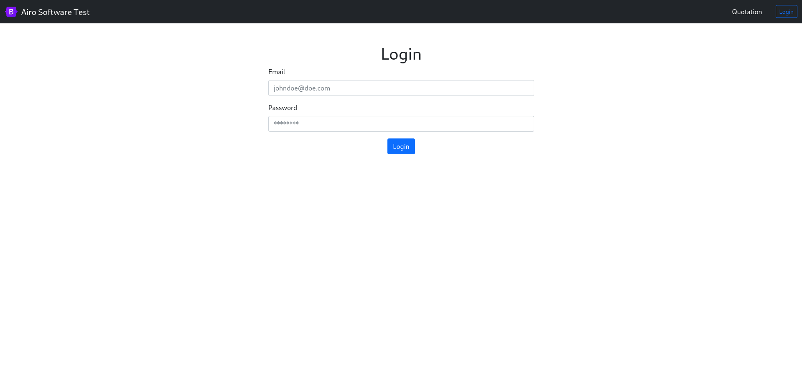
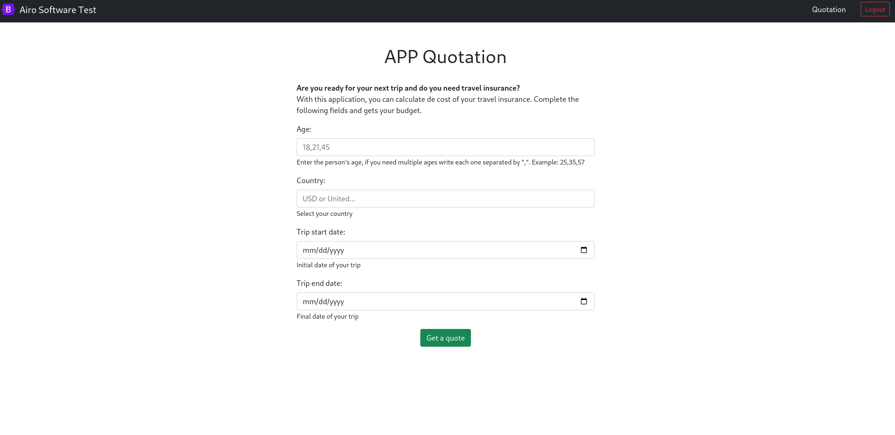

# Test Full Stack Developer

This repository contains code of the assessment for a full-stack developer position.

## How is the application composed?

This application is composed of an API (Backend) and APP (Frontend) within the same repository.

The API is powered by Laravel and the APP by React.js

You can find the API code distributed in the all folders of the Laravel application:
- `app/*`
- `databse/*`
- `test/*`
- `resources/views/*`

You can find the APP within the following folder:
- `/resources/js`

## Endpoints API

- `POST` `/api/v1/user/login` Returns the access token that allows the access to private page. 
- `POST` `/api/v1/user/logout` Invalidates the access token received.
- `POST` `/api/v1/quotation` Generates and stores a quotation.
 
## Endpoints APP

- `/`
- `/user/login`

## Installation process
``
The development server of this application is powered by Laravel Sail. To start the development server ensure you have 
free the ports 8080 and 3306 in your local machine

- Start app server and database with laravel sail: `./vendor/bin/sail up -d`
- Install composer dependencies: `./vendor/bin/sail composer install`
- Generate JWT secret key: `./vendor/bin/sail artisan jwt:secret`
- Generate certificate for JWT: `./vendor/bin/sail artisan jwt:generate-certs`
- Run migrations: `./vendor/bin/sail artisan migrate`
- Run database seeder: `./vendor/bin/sail artisan db:seed`
- Run fronted app `./vendor/bin/sail npm install && ./vendor/bin/sail npm run production`

## How to use the application (IMPORTANT!)

This application doesn't provide user registration, for that reason you can use the following credentials to log in within the application:

- `username:` airosoftware@test.com
- `password:` 12345
- `login page:` http://localhost/user/login``

## App screenshots

Login page `http://localhost/user/login`

Main page `http://localhost`

## License

The Laravel framework is open-sourced software licensed under the [MIT license](https://opensource.org/licenses/MIT).
